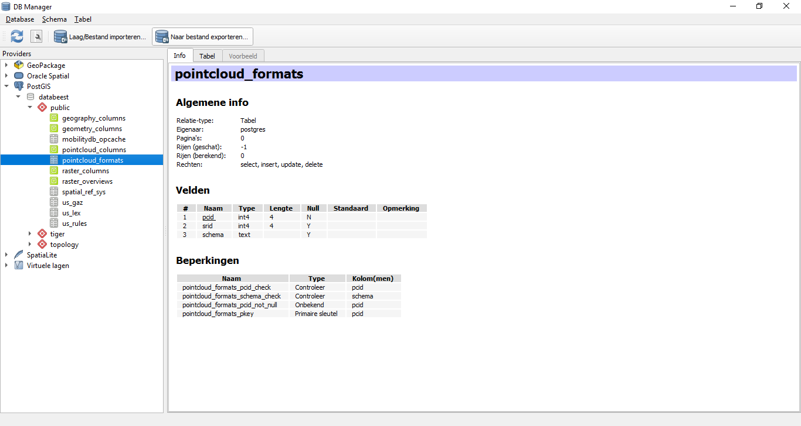
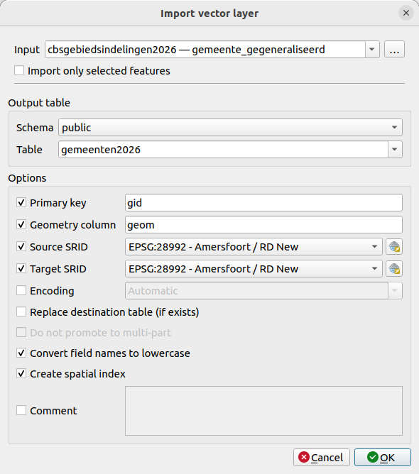

# Deel 1: Data importeren in PostGIS 
In dit deel gaan we een paar datasets importeren in onze nog (vrijwel) lege database. Voor het importeren van datasets in een database zijn veel goede tools voorhanden, zoals [GDAL](https://gdal.org/en/stable/index.html), waarmee je zo'n proces ook goed kan automatiseren. Een beperktere, maar wel veel eenvoudigere mogelijkheid is importeren via QGIS zelf, en wel de *DB Manager* plugin. Die gaan we in deze workshop gebruiken. 

Via QGIS gaan we twee datasets importeren in de database:

* [gemeentegrenzen (CBS)](https://service.pdok.nl/cbs/gebiedsindelingen/atom/v1_0/downloads/cbsgebiedsindelingen2026.gpkg)
* [windturbines (RIVM)](https://nationaalgeoregister.nl/geonetwork/srv/dut/catalog.search#/metadata/23d0d402-a6d9-47c5-a6f3-d7f7fb35cb79)

Download beide datasets. In geval van de windturbines, ga naar de link voor `alo:rivm_windturbines_ashoogte_actueel` en kies bij Download data voor een formaat om de dataset te downloaden, b.v. Shapefile.

Laad eerst beide datasets in QGIS. Zoals je ziet bevat de geopackage van het CBS een hele trits aan datasets: kies hier voor gemeente_gegeneraliseerd.

## DB Manager 
DB Manager kun je terugvinden in het QGIS menu onder *Database*. Vind je 'm daar niet, kijk dan in het menu bij *Plugins > Manage and install Plugins* of de plugin aan staat, vermoedelijk is dat niet zo. Zet hem aan en open 'm vervolgens.

In DB Manager kun je verbinding maken met je database connectie, en vervolgens direct de inhoud van de database bekijken en bevragen. Open in het linkerscherm bij *Providers* de *PostGIS* connecties: daar staat jouw gemaakte databaseconnectie bij. Klik deze aan en dan is de database verbonden in DB Manager, en kun je bij de inhoud. Afhankelijk van hoe een en ander bij de installatie is gegaan zie je een aantal dingen zoals hieronder:

In ieder geval heb je een **public** schema, met daarin in ieder geval wat tabellen, zoals *spatial_ref_sys*, *geometry_columns* en *geography_columns*. De database bevat echter nog géén geodata! Die gaan we eerst importeren.

## Importeren van geodata
Gebruik voor het importeren van datasets de knop de *Import Layer/File*.
Je krijgt een dialoogscherm waarmee je een dataset in de database kan importeren. 

Begin met de in QGIS ingeladen gemeenten:

* <ins>Input</ins>: kies de kaartlaag met gemeenten
* <ins>Schema</ins>: public
* <ins>Table</ins>: Deze wordt automatisch overgenomen vanuit QGIS, maar verander dit! Kies een niet te lange naam, zonder spaties of '-' streepje (underscore '_' mag wél.
* <ins>Primary key</ins>: vul hier een nieuw te maken veld in, bijvoorbeeld 'gid'.
* <ins>Geometry column</ins>: de naam voor de geometriekolom, gebruik standaard 'geom'.
* <ins>Source-</ins> en <ins>Target SRID</ins>: vul hier 28992 (Rijksdriehoekstelsel) in.
* <ins>Convert field names to lowercase</ins>: zeker doen!
* <ins>Create spatial index</ins>: altijd doen!

En nu maar eens kijken of de import lukt. Zo ja, kijk hoe het resultaat eruit ziet. Je het in het rechterscherm 3 tabbladen:

* <ins>Info</ins>: de metadata bij de geïmporteerde tabel; zaken als kolommen (en type), hoeveel rijen, indexen e.d.
* <ins>Table</ins>: een voorbeeldweergave van de attribuuttabel
* <ins>Preview</ins>: een simpele weergave hoe de tabel er als kaartlaag uitziet.

Als alles er oké uitziet, importeer dan ook de windturbines, en bekijk hoe dit eruit ziet. 

Laad vervolgens beide databasetabellen in het QGIS project: dat kan door ze naar het 'gewone' QGIS scherm te slepen, of door rechts klikken op de tabelnaam in het schema, en vervolgens *Add to Canvas* te kiezen.

Gelukt? Tijd om vragen te stellen aan de database!
[Deel 3: de database bevragen](3_database_bevragen.md)

