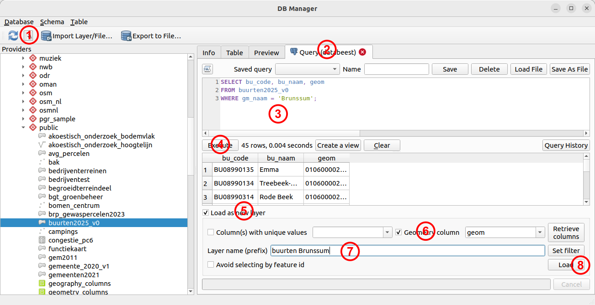

# Deel 3: Basis SQL

## Inleiding
Uitleggen wat we hierin gaan doen. 
Vanwege de korte workshop gaan we wat kort door de bocht.
Meer ervaring? Doe het dan volgens je eigen (vast betere!) regels. 
En verzin zelf uitdagendere vragen.


7. Koppeling: windturbines in jouw favoriete gemeente.
8. dat in QGIS laden.
9. totale kw in jouw gemeente
10. totale kw per gemeente (GROUP BY)
11. welke gemeente heeft de meeste kw?
12. 10 met geom, maak er een view van.
13. buffer windturbines
14. extra vragen 

## SQL syntax voor selecties
Eenvoudige SQL expresies in PostgreSQL (en PostGIS) gaan volgens een vast stramien. Hier een overzicht:

|volgorde|commando|verplicht?|betekenis|
|---|---|---|---|
|4|`SELECT`|verplicht|Kolom(men) die je wil selecteren. Met `*` selecteer je alles.|
|1|`FROM`|verplicht|Tabel(len) waaruit je wil selecteren|
|2|`WHERE`|optioneel|Voorwaarde waaraan de selectie moet voldoen|
|3|`GROUP BY`|optioneel|Samenvoegen (aggregeren) resultaten op 1 of meer kolommen|
|5|`ORDER BY`|optioneel|Sorteren van de resultaten op 1 of meer kolommen|

Belangrijk is de volgorde van de regels: die moet zijn zoals hier getoond. Echter: het is handig om bij het ontwerpen van een query de volgorde te hanteren zoals in de eerste kolom van dit overzicht. Dit is ook de volgorde die de database engine hanteert bij het uitvoeren.  
1. Begin dus bij `FROM`. Uit welke tabel wil je selecteren?
2. Daarna `WHERE`. Is er een voorwaarde?
3. `GROUP BY`. Moeten resultaten worden samengevoegd?
4. `SELECT`. Pas nu gaan we de kolommen selecteren! 
5. `ORDER BY`. Sorteren van de resultaten. `ASC` (oplopend) of `DESC` (aflopend).

**Een voorbeeld:**
```
SELECT naam, code, geom
FROM gemeenten
WHERE code = 'G0123';
```
In dit geval wordt de tabel **gemeenten** bevraagd (`FROM`). De tabel wordt gefilterd (`WHERE`) op de kolom *code*: alleen de rijen met een code 'G0123' moeten in het resultaat terugkomen. Let op de enkele quotes hierbij: dit is nodig bij het bevragen van tekstkolommen. Uiteindelijk worden van alle kolommen in de tabel alleen de *naam*, *code* en geometrie (*geom*) opgevraagd (`SELECT`), dus niet álle kolommen.

## SQL Window
DB Manager heeft naast een paar handige tools om de inhoud van de database te bekijken ook een tool om queries uit te voeren: het *SQL Window*.



Uitleg:
1. De knop om een *SQL Window* te openen,
2. Er verschijnt een extra tabblad rechts met een veld waarin je een SQL query kan bouwen.
3. Bouw hier je query op
4. Met *Execute* voor je je query uit en krijg je het resultaat te zien.
5. Met het vinkje bij (5) kun je het resultaat als een kaartlaag in QGIS toevoegen.
6. Let hierbij wél op dat je een *geometry column* kiest. En die moet in je query dus meegeselecteerd zijn!
7. Geef je nieuwe laag een naam.
8. Met *Load* wordt de laag daadwerkelijk in QGIS ingeladen.

**N.B.** DB Manager is tegenwoordig vrij goed met foutmeldingen. Gaat er wat mis, lees zo'n melding dan goed, en wellicht is dan snel duidelijk waaróm het mis is gegaan.

## Opdrachten
Spiek bij de voorbeeldquery hierboven en in de syntax-tabel en beantwoord de volgende vragen d.m.v. queries. 
1. Selecteer de hele gemeenten tabel (`SELECT *`)
2. Selecteer jouw favoriete gemeente (voeg er een `WHERE` voorwaarde aan toe)
3. Selecteer alleen de statnaam, statcode en geometrie uit de gefilterde tabel.
4. Laad het reesultaat van (3) als een nieuwe laag in QGIS.
5. Selecteer uit de windturbines tabel alleen de ashoogte, diameter en het vermogen (kw)
6. Bereken het totale vermogen in kilowatt voor de windturbines in heel Nederland. Let op: je ziet in de kolom *land* verschillende waarden, je moet alleen de winturbines bevragen die in Nederland liggen (dus een `WHERE` voorwaarde). Het totaal (alle waarden optellen) kan d.m.v. het statement `SUM(kolom)`. Als het goed is krijg je maar één rij en één kolom terug met alleen het getal dat deze waarde bevat.

Extra:
7. Kun je ook het totale vermogen per *land* berekenen? Dus het vermogen in Nederland, België enz. Hier moet je iets met een `GROUP BY` verzinnen. 

