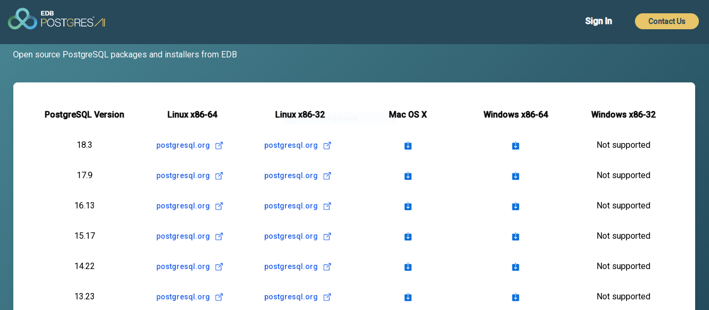
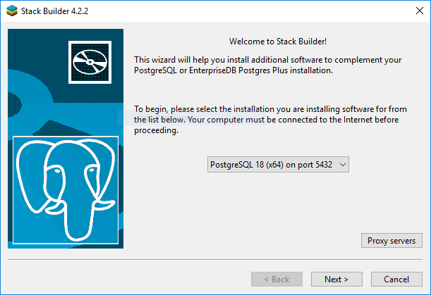
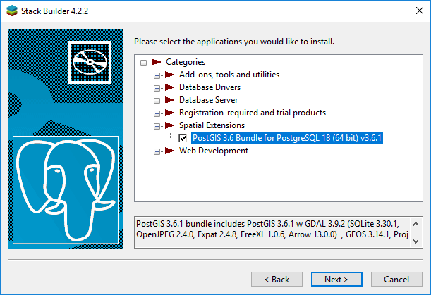

# Inleiding
Tijdens deze workshop ga je aan de slag met PostGIS. 

## Uitgangspunten
Voor de oefeningen in deze workshop heb je de volgende zaken nodig:
- QGIS
- PostgreSQL / PostGIS

## Installatie QGIS
Voor de installatie van QGIS verwijzen we naar de [QGIS website](https://www.qgis.org/en/site/forusers/download.html)
Hier kun je een installatiebestand kiezen, afhankelijk van wensen en je operating system. We raden je aan om de LTR versie (3.44) te kiezen in plaats van 4.0. Deze laatste heeft vermoedelijk nog wel wat last van 'kinderziekten' waardoor sommige dingen niet helemaal lekker werken.
Mocht je al een wat oudere versie van QGIS hebben, dan is dat geen enkel probleem: die kun je gewoon gebruiken.

## Installatie PostgreSQL / PostGIS
PostGIS zelf is geen programma, het is een extensie op het database management systeem PostgreSQL. Je moet dus eerst PostgreSQL installeren: dat kan via de [EnterpriseDB](https://www.enterprisedb.com/downloads/postgres-postgresql-downloads) website.

Je kan hier, afhankelijk van je operating system, een download kiezen: 
 

Er zijn verschillende versies, de meest recente staat bovenaan. Over het algemeen zijn de versies wel stabiel, maar pas op bij de “.0” versies: als er zo’n versie bovenaan staat (b.v. “18.0”), raden we je aan om een iets oudere te nemen.

Bij het installeren doorloop je een paar menuutjes:
- <ins>Select Components</ins>: vink hier alles aan
Data directory: zorg ervoor dat deze naar een locatie verwijst waar je veel schijfruimte hebt
Password (administrator): vul hier postgres in, of eventueel iets anders naar keuze. Belangrijk is wel dat je het onthoudt: hiermee log je als administrator in!
Port: 5432
Advanced Options: Default locale.
De rest is *next > next > finish*.

Als de installatie klaar is, krijg je meteen de vraag om *StackBuilder* te openen. Doe dit: met *StackBuilder* kun je namelijk additionele componenten (PostGIS!) installeren. Als dit niet gebeurt: open *StackBuilder* dan zelf via het *applicaties* menu.

Kies in *Stackbuilder* eerst de geïnstalleerde PostgreSQL versie (is er waarschijnlijk maar één), vervolgens kun je bij *Spatial Extensions* **PostGIS** installeren. Vink die dus aan, pak de nieuwste versie. PostGIS wordt vervolgens gedownload en geïnstalleerd. 

Tijdens de installatie krijg je de vraag "create spatial database?". Doe dit: er wordt dan meteen een ruimtelijke (PostGIS enabled) database aangemaakt, dat scheelt weer werk. De meeste andere vragen die langs komen wijzen zichzelf wel. Let wel op de locatie van de nieuw te installeren database: dit moet op een plek zijn waar voldoende schijfruimte vrij is. 

PostgreSQL is nu geïnstalleerd, inclusief de PostGIS extensie. Als het goed is heb je ook pgAdmin 4: dat is de beheer interface die (bij Windows!) standaard wordt meegeïnstalleerd. Je kán 'm gebruiken, maar voor de oefeningen in deze workshop gaan we de database direct via QGIS benaderen.
